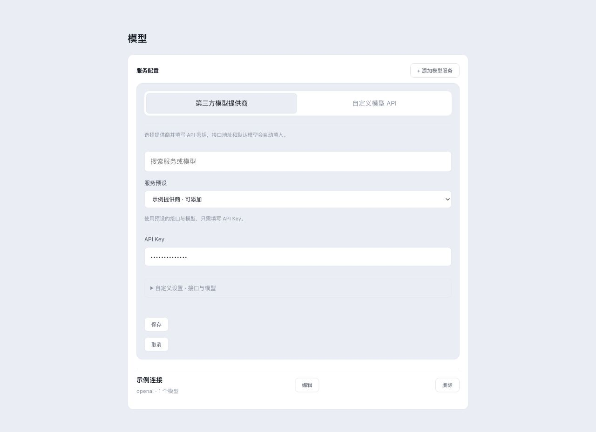

# Harness 风格添加模型流程

用户明确选择按截图参考 Harness。本次仅调整 Tauri 添加模型入口，参考本地 deepseek-harness 的 ModelsSection.tsx / ProviderEditor.tsx；保留原有配置管理与凭据管理入口。

- 统一添加卡片，第三方提供商 / 自定义 API 两个模式；不默认选择字母序首项。
- API Key 位于主流程，第三方接口和模型默认值折叠展示，添加后可编辑；自定义 API 必填项直接显示，其他请求设置折叠。
- 模式切换保留各自草稿；切换提供商清除该密钥草稿。写入仍通过原 tauriBridge 与 keychain_save，不新增原生权限。
- 配置持久化后凭据拒绝或状态刷新失败可单独重试；重新查询已保存状态，避免重复安装或重写已完成凭据。保留现有已配置的同组路由凭据。

## 验证

Node v24.21.0 下 provider-connect、原 settings-api-key 回归、目标组件 ESLint、tsc --noEmit 均退出 0，日志见本目录。新测试覆盖无隐式默认选择、草稿隔离、默认折叠、部分凭据失败、仅刷新失败与重试。

浏览器通过统一 CUA in-app browser，临时 mock IPC 页面复用真实组件；已检查两种模式、折叠状态、掩码输入、切换草稿和 390px 窄窗无横向溢出。最终重新打开的干净页面无 console error/warn；编辑 fixture 时旧 HMR 页曾出现 locale context 错误，未作为产品结论。fixture 与服务器已移除/停止。截图仅含假 canary 输入。

## 范围与待验

以上是源码回归与 mock 浏览器交互，不能代替真实钥匙串授权/拒绝、真实提供商连接或新安装包功能 smoke。后续打包结果单独记录，不继承历史包的原生验收。D 稳定与 E 全项验收及 A/B/C 发布缺口继续保留；正式发布与切换默认下载项仍须另行授权。

## 构建预算复核

首轮打包在前端语言包预算门禁失败，简中 79.1 KiB 超过 78.9 KiB。删除本次界面替换后全前端无引用的 10 个旧 Preview 标签（三种语言同步），再次构建后简中仍保持 78.9 KiB 原预算内；繁中有界增加 0.3 KiB 至 79.6 KiB，保留新增凭据恢复说明。首屏 JS、CSS 与 raw 预算不变，完整 pnpm build 退出 0，见 frontend-build.log。此次预算变化不是原生功能验收。

## 提交后打包

功能提交 a75461bde，语言包修正提交 d38abcd95；干净 d38abcd9599ac13d1a26393ff0115af4002bca46 构建退出 0。严格 deep 签名与 hdiutil verify 均通过（ad-hoc Preview，未公证）。新 host/sidecar/DMG SHA256 和源状态见 package-receipt.json。

DMG 保留在 desktop/tauri/target/release/bundle/dmg/Reasonix Tauri Preview_0.1.0_aarch64.dmg。为遵守用户此前清理重复图标的要求，构建 app 注销并可逆移动到回执记录的隐藏临时目录，同时注销本次打包临时卷注册；LaunchServices 最终仅保留 Applications 中的两个已安装 Reasonix 应用。没有替换它们，也没有正式发布。本包尚未完成安装后功能 smoke，历史原生结果不能继承为通过。
